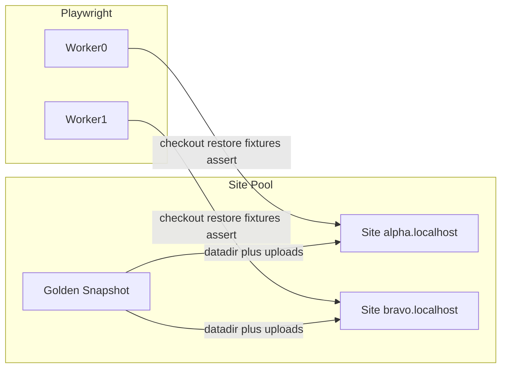
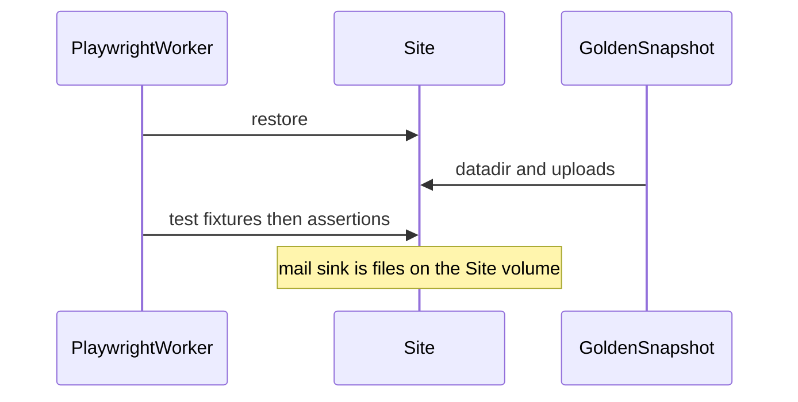

# Isolated Playwright Site Pool

> **Proposed.** Not implemented. Design for a later spike. Today’s e2e runner is
> still one WordPress at `PUBLISHPRESS_CART_HOST` — see
> [regression-tests.md](regression-tests.md), [admin-tests.md](admin-tests.md),
> [smoke-tests.md](smoke-tests.md), and
> [email-settings-gate-tests.md](email-settings-gate-tests.md).

Opt-in isolated WordPress **Sites** for Playwright. Playwright stays the
scheduler. Isolation is one Site per test via snapshot restore on N recycled
containers (no X spare until restore is proven slow). Cart is the proving
ground; the pool is shaped as a library for other plugins later.

**Status:** design locked 2026-09-14. The existing single-host runner stays
the default until the pool is boring.

## Glossary

- **Site**: one Docker container (PHP + web + MariaDB) with its own URL, DB,
  uploads, and mail sink. Not a DDEV project, not a Playwright process.
- **Site Pool**: N running Sites, N = Playwright workers.
- **Golden Snapshot**: restore point (MariaDB datadir + per-Site `wp-content`
  except the bind-mounted plugin).
- **Suite Seed**: Cart-specific catalog applied once, then snapshotted (today’s
  `test:regression:setup` / `test:admin:setup`, mocked or real).
- **Test Fixture Procedure**: extra setup one spec runs after restore (unique
  customers, `triggerFixture`, UI toggles).
- **Mail Sink**: Site-local `.eml` drop, not Mailpit. Snapshot restore empties
  it.
- **Site Replenisher**: deferred. Only if datadir restore idle time forces an
  X spare queue.

Do not call Playwright Workers, Sites, and a future Replenisher all “workers”.

Cart’s product [CONTEXT.md](../../../CONTEXT.md) stays the Order/Customer
glossary. Harness terms belong in `packages/wp-site-pool/CONTEXT.md` when that
package is created.

## Architecture

**globalSetup:** start N named containers from the library WP image, bind-mount
Cart, apply Suite Seed, take one Golden Snapshot, clone it onto every Site
(dynamic `WP_HOME` / `WP_SITEURL` from `HTTP_HOST` so the DB is not name-baked).

**Per test:** restore snapshot on that worker’s Site, run Test Fixture
Procedure, assert. Playwright HTML/list reporter unchanged.

**globalTeardown:** destroy containers. On local failure,
`PW_KEEP_SITE_ON_FAILURE=1` skips restore so you can open
`http://alpha.localhost:<port>`.

## Locked decisions

- **Scheduler:** Playwright (`fullyParallel` already in
  [playwright.config.ts](../../../playwright.config.ts)). No custom test queue.
  Site assignment = worker index → dictionary name (`alpha`, `bravo`, …).
- **Isolation:** per-test cleanliness, N recycled Sites, in-place datadir
  restore. X spare only after a spike shows restore idle is worse than swapping
  a hot Site.
- **Runtime:** one Docker container per Site (web + MariaDB). DDEV (or whatever
  `PUBLISHPRESS_CART_HOST` points at) stays the default e2e target and the
  human-driven Cart site. The pool is a second, opt-in runner.
- **Layers:** library image = WordPress only. Cart builds Suite Seed on top.
  Pool v1 seeds mocked gateways. Real Stripe/PayPal stays on the existing host
  path unless someone explicitly starts the pool with the real seed (N=1–2).
  No N× `stripe listen` in v1.
- **Files:** bind-mount plugin PHP; per-Site volume for DB + `wp-content`
  except that plugin (`uploads/ppcart-uploads`, cache, debug.log, mail sink).
  Tests must not write plugin PHP.
- **Mail:** two backends behind one `Mailbox` helper. Host path keeps Mailpit
  (`MAILPIT_URL`, `deleteAll()`, `--workers=1`, `assertSerialExecution()`).
  Pool uses a Site-local `.eml` sink and skips the serial lock because each
  test has its own WordPress and mailbox. Isolated Sites already remove the
  shared `options.php` collision documented in
  [tests/playwright/support/email-settings.ts](../../../tests/playwright/support/email-settings.ts).
- **Runner migration:** opt-in. `composer test:regression` / `test:admin` /
  `test:email` / `test:smoke` stay on `PUBLISHPRESS_CART_HOST`. New scripts
  (or `PPCART_E2E_POOL=1`) start the pool and run the same specs against Sites.
  Do not delete the single-host path in v1.
- **Package home:** `packages/wp-site-pool/` with its own `package.json`,
  consumed via `file:`. Cart-only seed/scripts stay under `tests/`. No npm
  publish until a second plugin consumes it.

## Library vs Cart

Library owns: Dockerfile (PHP matching Cart’s declared minimum + MariaDB +
sendmail-to-dir), name dictionary, proxy/`*.localhost` routing,
snapshot/restore, Playwright worker fixture
`{ name, url, restore(), mailbox }`.

Cart owns: bind-mount path, Suite Seed (run the existing
[tests/bin/lib/wp-env.sh](../../../tests/bin/lib/wp-env.sh) +
[tests/ppcart-fixtures/ppcart-regression-fixtures.php](../../../tests/ppcart-fixtures/ppcart-regression-fixtures.php)
/ admin fixtures *inside* a Site via WP-CLI, without removing the host-path
setup), per-spec fixtures, mocked vs real seed profiles.

## Playwright binding

Default run: unchanged. `baseURL` from `PUBLISHPRESS_CART_HOST`, admin
`storageState`, Mailpit from env.

Pool run (`PPCART_E2E_POOL=1` or dedicated composer scripts):
**worker-scoped Site** + **test-scoped restore** override `baseURL`.

- Worker 0 always gets dictionary slot 0 (`alpha`).
- Admin `storageState` cannot be one shared file on the pool (origin-bound;
  session tokens vanish on datadir restore). Log in (or inject a Suite-Seeded
  session cookie) **after each restore** for admin/email. Host path keeps
  today’s `admin-setup` project.
- Specs talk to a `Mailbox` helper. Host path: Mailpit adapter
  (`Mailpit.fromEnv()`). Pool: `site.mailbox` over the `.eml` sink. Same
  wait/expect/attachment API.
  [tests/playwright/support/mailpit.ts](../../../tests/playwright/support/mailpit.ts)
  becomes that interface plus the Mailpit backend.

Identity (pool only): `http://alpha.localhost:<port>` (`*.localhost` →
127.0.0.1, no `/etc/hosts`). Small pool proxy or per-container published ports
plus dynamic `HTTP_HOST`.

## First spike (must happen before the rest)

One container, Suite Seed, datadir restore, one Playwright spec twice. Record
restore wall time. If restore is ~1–3s, keep X=0. If it is many seconds,
revisit X spare / Replenisher (original hot-queue idea).

Then two workers + two specs that collide today (for example an `@email`
settings save vs another `@email` save, or two upload/Download tests) must
pass in parallel.

## Cart wiring after the spike

- Existing `composer test:regression` / `test:admin` / `test:email` /
  `test:smoke` and `test:regression:setup` stay as they are (single host +
  Mailpit).
- Add parallel entry points, e.g. `composer test:regression:pool` (and
  admin/email/smoke equivalents), or one flag `PPCART_E2E_POOL=1` that
  `globalSetup` honors.
- Pool v1 uses the mocked Suite Seed. Real-gateway on the pool is optional
  later (N=1–2).
- Reporting stays Playwright (`list` + `html` already in config).

## Build order

1. Add `packages/wp-site-pool` (CONTEXT.md, Dockerfile WP+MariaDB+mail sink,
   dictionary, snapshot/restore, Playwright site fixture).
2. Spike one Site: Suite Seed, datadir restore timing, one spec twice; decide
   X=0 vs spare queue.
3. N named `*.localhost` Sites, bind-mount plugin, isolated uploads/DB,
   worker-index assignment.
4. Run existing regression/admin fixture setup inside the Site as Suite Seed
   (mocked + real profiles).
5. Add `Mailbox` interface; host path keeps `Mailpit.fromEnv`; pool uses Site
   mail sink and skips the workers=1 lock.
6. Add opt-in pool runner (composer/env flag); keep `PUBLISHPRESS_CART_HOST`
   as default; pool overrides `baseURL` and admin login only when enabled.

## ADRs to write in `packages/wp-site-pool/docs/adr/`

Write these when implementation starts (surprising + hard to reverse):

1. Playwright schedules; pool only assigns Sites.
2. One-container Docker + MariaDB datadir restore, not DDEV, not
   destroy/recreate.
3. Two-layer snapshots (generic WP image, project Suite Seed).
4. Site-local mail sink, not Mailpit-in-container.

## Out of scope for v1

- Custom orchestrator / event bus / specialist create-worker.
- X spare hot queue (until spike says so).
- Publishing the package.
- Making the pool the default runner (revisit after it is boring).
- Stripe webhook fan-out to N Sites.
- Codeception unit/integration (already a different isolation story).
