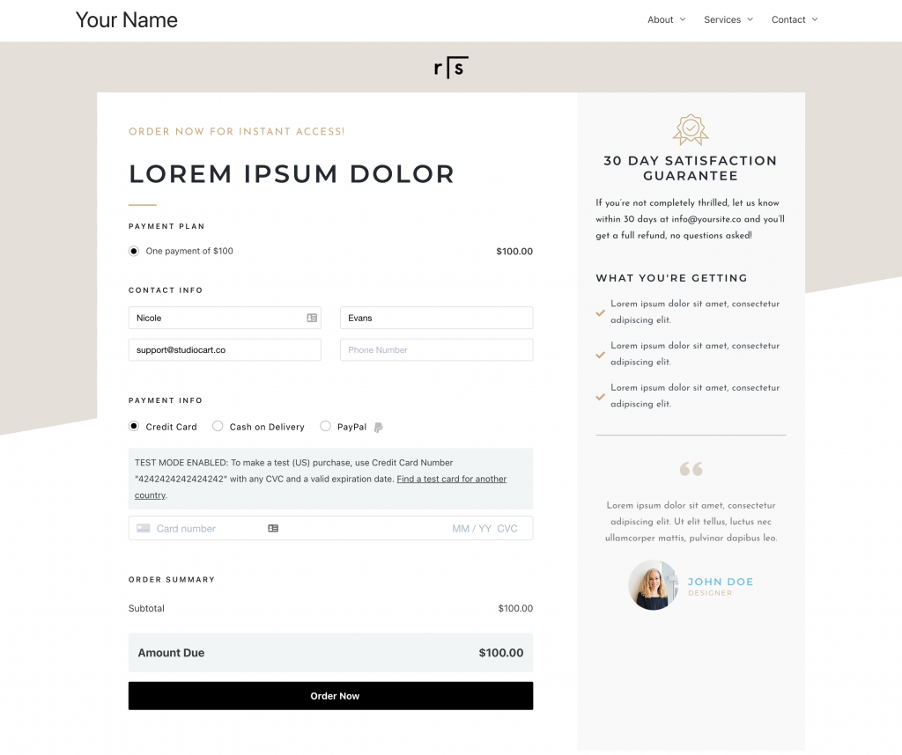
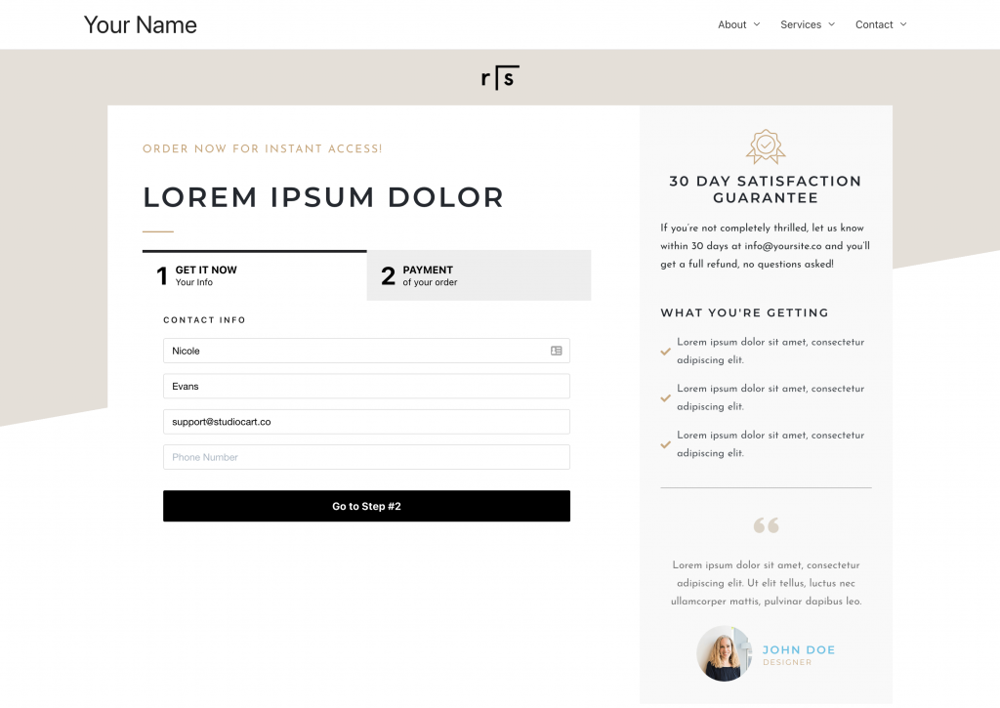

# Form skin types

PublishPress Cart supports four checkout form layouts: **default**, **two-step**,
**opt-in**, and **split-in**. Choose the skin via the shortcode or Gutenberg
block `template` parameter (`2-step`, `opt-in`, `split-in`).

## Default form

The standard single-page checkout form for paid products. You can show or hide
payment plans, form fields, and section headings from product settings.



## Two-step form

The two-step layout splits checkout into contact details first, then payment:

1. **Step 1** — contact information, address fields, and custom fields
2. **Step 2** — payment plan, payment method, order bumps, and order summary

You can customize step headings, subheadings, and button labels in **Form
Fields**.



Use the `template` shortcode parameter for embedded forms:

```text
[ppcart_form id="123" template="2-step"]
```

## Opt-in form

The opt-in skin is for **free products only**. To match the layout below:

1. Under **Payment Plans**, enable **Hide Plans Section**
2. Under **Integrations**, enable **Enable Opt-in Checkbox**
3. Hide field labels with `hide_labels="hide"` on the shortcode or block
4. Set the opt-in checkbox label, submit button text, and form fields heading
5. Optionally add custom Terms & Conditions and Privacy Policy URLs


When embedding with a shortcode:

```text
[ppcart_form id="123" template="opt-in"]
```

## Split-in form

The split-in layout is a two-column checkout: order summary on the left,
contact and payment fields on the right. Product pages apply the
`ppcart-splitin-form` class when split-in is selected. Gutenberg Checkout
and the shortcode `template` parameter accept `split-in`.

```text
[ppcart_form id="123" template="split-in"]
```
